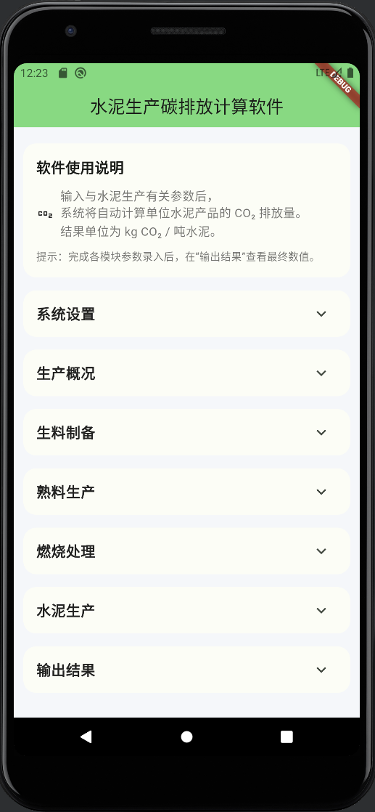
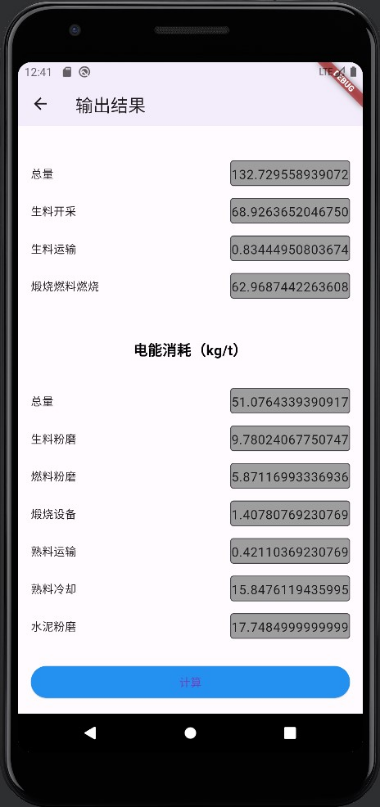

# Cement Production CO₂ Emission Calculator

A Flutter-based cross-platform application for estimating CO₂ emissions (kg CO₂ per ton) in cement production.

---

## Overview

This project is an engineering-oriented carbon emission calculation tool designed to estimate the carbon intensity of cement manufacturing processes.

Users input production-related parameters across multiple stages, and the system automatically calculates total CO₂ emissions per ton of cement, along with detailed breakdown results.

The software is developed using Flutter to support cross-platform deployment (Android / iOS / Web / Windows).

---

## Application Interface Preview

### 1️⃣ Main Interface – Modular Input System

The main interface adopts a structured modular design.  
Users can expand each section and input process-related parameters for different stages of cement production.

Included modules:

- System configuration  
- Production overview  
- Raw material preparation  
- Clinker production  
- Fuel processing  
- Cement grinding  
- Output results  

This structure ensures clarity, scalability, and engineering usability.

---

### 2️⃣ CO₂ Emission Result Page

After completing parameter input, the system automatically calculates:

- Total CO₂ emissions (kg CO₂ / t cement)
- Raw material decomposition emissions
- Fuel combustion emissions
- Electricity consumption emissions
- Process-level energy breakdown

The result interface clearly presents both total emissions and stage-level contributions, supporting transparent carbon accounting and process analysis.

---

## Calculation Scope

The emission model includes:

- Raw material decomposition emissions  
- Fuel combustion emissions  
- Electricity-related indirect emissions  
- Process energy consumption  

Final output:

> **kg CO₂ per ton of cement**

---

## Tech Stack

- Flutter  
- Dart  
- Material Design 3  
- Cross-platform deployment (Android / iOS / Windows / Web)

---

## Engineering Features

- ✔ Modular industrial process modeling  
- ✔ Automated CO₂ emission calculation  
- ✔ Stage-level emission breakdown  
- ✔ Structured engineering logic  
- ✔ Clean UI design  
- ✔ Cross-platform compatibility  

---

## Purpose

This project demonstrates:

- Industrial carbon emission modeling  
- Engineering software development  
- Structured data handling  
- Applied sustainability computation  
- Cross-platform Flutter application development  

---

## License

Private project – for technical demonstration purposes only.
